## LATIHAN 1

Program ini menunjukkan cara menggunakan **dictionary** di Python untuk
**membuat** daftar kontak.

### Fitur Program

1.  Menampilkan nomor kontak Tedi
2.  Menambahkan kontak baru Mhe
3.  Mengubah nomor kontak Adell
4.  Menampilkan semua nama
5.  Menampilkan semua nomor
6.  Menampilkan semua nama dan nomor
7.  Menghapus kontak Adell

## Penjelasan code  

### Membuat dictionary daftar kontak  

``` python
kontak = {
    "Tedi": "0812678888",
    "Adell": "087677776"
}
```
### 1. Tampilkan kontak Tedi  

``` python
print("Kontak Tedi:", kontak["Tedi"])
```
### 2. Tambah kontak baru dengan nama Mhe  

``` python
kontak["Mhe"] = "087654544"
print("\nSetelah menambah kontak Mhe:", kontak)
```

### 3. Ubah kontak Adell dengan nomor baru  

``` python
kontak["Adell"] = "088999776"
print("\nSetelah mengubah nomor Adell:", kontak)
```

### 4. Tampilkan semua nama  

``` python
print("\nDaftar Nama:")
for nama in kontak.keys():
    print("-", nama)
```

### 5. Tampilkan semua nomor  

``` python
print("\nDaftar Nomor:")
for nomor in kontak.values():
    print("-", nomor)
```

### 6. Tampilkan daftar Nama dan Nomor  

``` python
print("\nDaftar Nama dan Nomor:")
for nama, nomor in kontak.items():
    print(f"- {nama}: {nomor}")
```
### 7. Hapus kontak Adell  

``` python
del kontak["Adell"]
print("\nSetelah menghapus Adell:", kontak)
```  
## TUGAS PRAKTIKUM  

# Flowchart Program


# Penjelasan Program
```python
data_mahasiswa = {}
```
> Ini adalah tahap deklarasi yang berisikan _dictionary_ kosong yang nantinya akan diisi sebuah data.

```python
while True:
```
> Pada tahap selanjutnya terdapat sebuah perulangan dengan metode _while_ yang kondisinya _True_ yang artinya, dalam perulangan itu akan terus mengulang sampai kode di dalamnya memberikan sebuah kondisi yang menggunakan metode _break_.

```python
user = input("\n(T)ambah, (U)bah, (H)apus, (C)ari, (L)ihat, (K)eluar: ")
```
> Kode ini dituliskan di dalam perulangan _while_ yang fungsinya untuk user agar menginputkan pilihan yang ada pada program dan inputan tersebut akan dibuatkan sebuah kondisi-kondisi tertentu jika menginputkan pilihan tertentu, kondisi tersebut disebut _if else_.

```python
if user.lower() == 't':
        os.system("cls")
        print("Tambah Data")
        nama = input("Nama           : ")
        nim = int(input("NIM            : "))
        uts = int(input("Nilai UTS      : "))
        uas = int(input("Nilai UAS      : "))
        tugas = int(input("Nilai Tugas    : "))
        akhir = tugas*30/100 + uts*35/100 + uas*35/100
        data_mahasiswa[nama] = nim, uts, uas, tugas, akhir
```
> Jika user meningput "t" yang artinya menambah data, maka user akan diberikan tampilan inputan seperti diatas. Inputan-inputan tersebut dimasukkan ke dalam _dictionary_ kosong dengan inputan user.


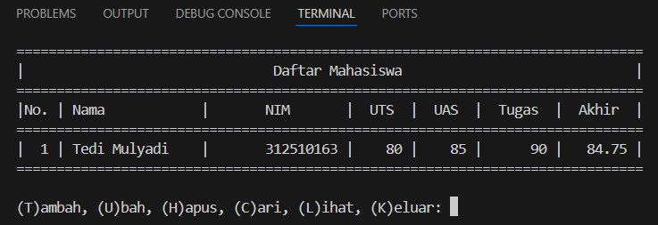

```python
elif user.lower() == 'u':
        os.system("cls")
        print("Ubah Data")
        nama = input("Masukkan Nama  : ")
        if nama in data_mahasiswa.keys():
            nim = int(input("NIM            : "))
            uts = int(input("Nilai UTS      : "))
            uas = int(input("Nilai UAS      : "))
            tugas = int(input("Nilai Tugas    : "))
            akhir = tugas * 30 / 100 + uts * 35 / 100 + uas * 35 / 100
            data_mahasiswa[nama] = nim, uts, uas, tugas, akhir
        else:
            print(f"Nama {nama} tidak ditemukan")
```
> Jika user menginput "u" yang artinya ubah data mahasiswa, maka user harus memasukkan nama yang diubahnya. Jika nama tersebut ada di dalam _dictionary_, maka selanjutnya mengubah data yang memang perlu diubah. 

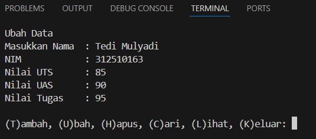
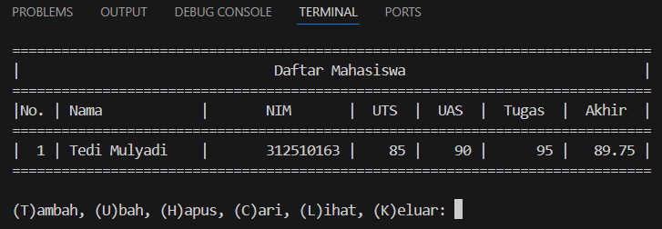

> Jika nama tersebut tidak ada di dalam dictionary, maka akan mengirimkan pesan bahwa nama tersebut tidak ditemukan.

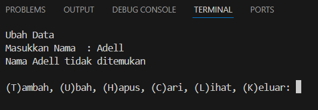

```python
elif user.lower() == 'h':
        os.system("cls")
        print("Hapus Data")
        nama = input("Masukkan Nama  : ")
        if nama in data_mahasiswa.keys():
            del data_mahasiswa[nama]
        else:
            print(f"Nama {nama} Tidak Ditemukan")
```
> Jika user menginputkan "h" yang artinya hapus data, maka user akan menghapus data sebelumnya yang sudah dibuat dan user diharuskan mengisi data nama yang ingin di hapus. 
- Data yang sudah dibuat  

- Data setelah dihapus  
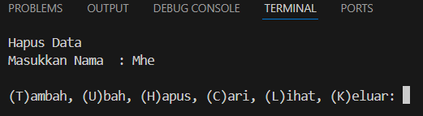

- Jika nama tidak ada di dalam _dictonary_, maka akan menampilkan pesan nama tersebut tidak ditemukan.  
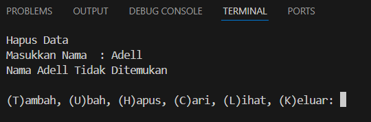
```python
elif user.lower() == 'c':
        os.system("cls")
        print("Cari Data")
        nama = input("Masukkan Nama : ")
        if nama in data_mahasiswa.keys():
            print("="*73)
            print("|                             Daftar Mahasiswa                          |")
            print("="*73)
            print("| Nama            |       NIM       |  UTS  |  UAS  |  Tugas  |  Akhir  |")
            print("="*73)
            print("| {0:15s} | {1:15d} | {2:5d} | {3:5d} | {4:7d} | {5:7.2f} |"
                  .format(nama, nim, uts, uas, tugas, akhir))
            print("="*73)
        else:
            print(f"Nama {nama} Tidak Ditemukan")
```
> Jika user menginputkan "c" yang artinya cari data, maka user diharuskan mengisi data nama yang ingin di cari, data yang di cari akan mengambil data yang sudah ditambahkan pada _dictionary_, lalu ditampilkan ke user. 

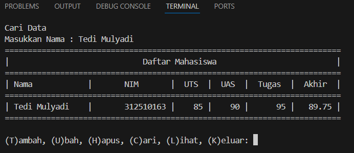

> Jika nama tersebut tidak ada pada data _dictionary_, maka akan menampilkan pesan nama tidak ditemukan.

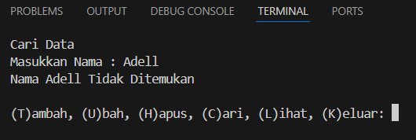

```python
elif user.lower() == 'l':
        os.system("cls")
        if data_mahasiswa.items():
            print("="*78)
            print("|                               Daftar Mahasiswa                             |")
            print("="*78)
            print("|No. | Nama            |       NIM       |  UTS  |  UAS  |  Tugas  |  Akhir  |")
            print("="*78)
            i = 0
            for data in data_mahasiswa.items():
                i += 1
                print("| {no:2d} | {0:15s} | {1:15d} | {2:5d} | {3:5d} | {4:7d} | {5:7.2f} |"
                      .format(data[0], data[1][0], data[1][1], data[1][2], data[1][3], data[1][4], no=i))
            print("=" * 78)
        else:
            os.system("cls")
            print("="*78)
            print("|                               Daftar Mahasiswa                             |")
            print("="*78)
            print("|No. | Nama            |       NIM       |  UTS  |  UAS  |  Tugas  |  Akhir  |")
            print("="*78)
            print("|                                TIDAK ADA DATA                              |")
            print("="*78)
```
> Jika user menginputkan "l" yang artinya lihat data, maka user akan diberikan tampilan daftar mahasiswa. Jika data tersebut sudah ditambahkan, maka data tersebut akan ditampilakn dengan memanggil tiap-tiap element yang sudah diinputkan. 

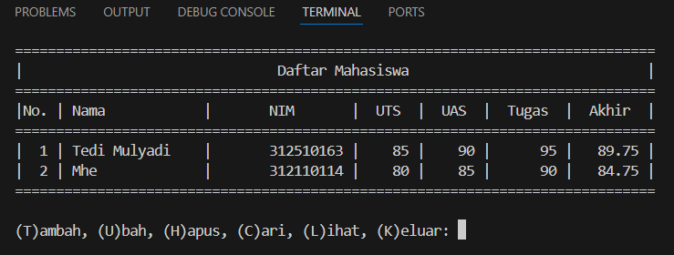

> Jika data sebelumnya belum ditambahkan, maka akan menampilkan tidak ada data.

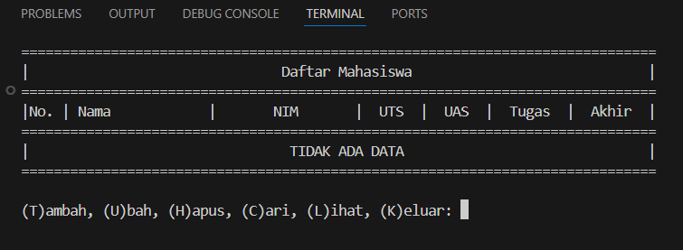

```python
elif user.lower() == 'k':
        os.system("cls")
        break
```
> Jika user menginputkan "k" yang artinya keluar dari program, maka program akan berakhir dan fungsi dari _break_ akan memberhentikan program tersebut.

```python
else:
        print("Pilih menu yang tersedia")
```
> Jika user tidak menginputkan apapun di dalam program, maka akan menampilkan sebuah pesan "Pilih menu yang tersedia".

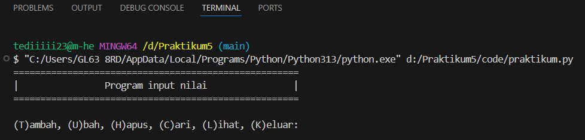
